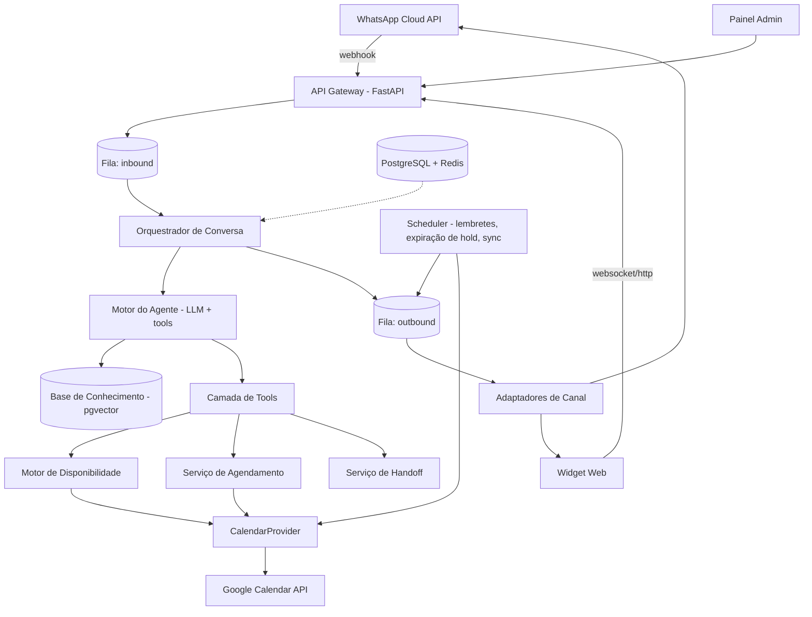
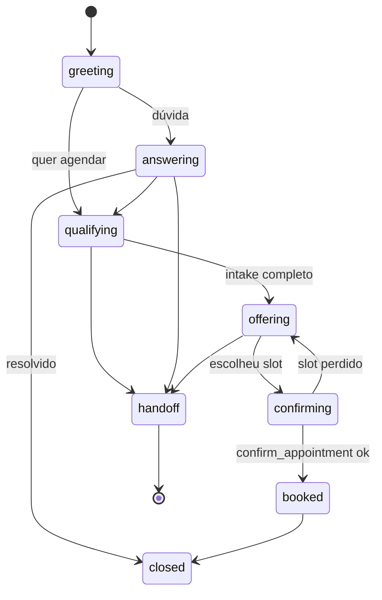

# Spec de Produto — Agente de Atendimento e Agendamento

**Produto:** Datamind Agenda AI (nome de trabalho)
**Versão da spec:** 1.0
**Data:** 2026-09-06
**Autor:** Matheus Andrade — Datamind
**Status:** Aprovada para implementação (Fase 0)
**Público desta spec:** Claude Code + desenvolvedores humanos

---

## 0. Como usar esta spec

Esta spec é escrita para ser fatiada em tarefas de implementação. Ordem sugerida de trabalho:

1. Ler seções 1–3 (contexto e domínio) uma vez.
2. Implementar na ordem do roadmap da **seção 20**, não na ordem do documento.
3. Cada fase do roadmap referencia as seções técnicas que precisam ser lidas naquele momento.
4. Os requisitos são numerados (`RF-xx`, `RNF-xx`). Todo PR deve citar quais requisitos atende.
5. Os critérios de aceite da seção 20 são a definição de pronto de cada fase.

**Regra de ouro do projeto:** o produto é **um único codebase multi-tenant**. Nada específico de um cliente vai para o código — vai para configuração (seção 10) e base de conhecimento (seção 11.6). Se um pedido de cliente exigir mudança de código, ele vira feature genérica com flag, ou não é feito.

---

## 1. Visão do produto

### 1.1 Problema

Prestadores de serviço com atendimento por hora marcada (clínicas médicas e veterinárias, nutricionistas, fisioterapeutas, massoterapeutas, salões, estúdios) perdem receita em três pontos:

- **Latência de resposta.** O contato chega por WhatsApp fora do horário ou durante o atendimento; a resposta demora horas e o lead procura outro.
- **Custo de recepção.** Uma recepcionista gasta a maior parte do tempo respondendo as mesmas 15 perguntas (preço, convênio, endereço, estacionamento, o que levar) e negociando horário.
- **Agenda mal preenchida.** Cancelamentos de última hora deixam buracos que ninguém preenche ativamente.

### 1.2 Proposta

Um agente conversacional que atua como primeira linha de atendimento no WhatsApp (e em widget no site), capaz de:

- responder dúvidas com base na base de conhecimento **daquele cliente**;
- **qualificar** o contato — entender quem é, o que precisa, se é primeira vez, qual serviço/profissional, convênio/forma de pagamento, urgência;
- **propor horários reais** cruzando a agenda do prestador com a disponibilidade declarada pelo cliente final;
- **efetivar o agendamento** criando o evento na agenda do prestador e confirmando pelos dois lados;
- **remarcar e cancelar**;
- **lembrar e confirmar** presença antes do horário;
- **escalar para humano** quando sai do escopo, quando há risco, ou quando o cliente final pede.

### 1.3 Modelo de negócio (contexto para decisões técnicas)

- Produto padronizado, **setup personalizado por cliente** (linguagem, serviços, regras, base de conhecimento, integrações).
- Cobrança recorrente por tenant + setup inicial.
- Datamind opera a infraestrutura. O cliente não hospeda nada.
- **Consequência técnica:** multi-tenancy real desde o dia 1, custo por conversa observável por tenant, e onboarding de novo cliente deve ser um runbook de horas — não de semanas (seção 16).

### 1.4 Verticais alvo (v1)

| Vertical | Particularidade que a config precisa cobrir |
|---|---|
| Clínica veterinária | Paciente ≠ contato (o pet). Espécie/porte muda duração e preço. Urgência/emergência exige escalonamento imediato. |
| Clínica médica / odontológica | Convênios, primeira consulta vs retorno, preparo prévio, dados de saúde (LGPD reforçada). |
| Nutricionista / fisioterapeuta / psicólogo | Sessões recorrentes, pacotes, online vs presencial. |
| Salão de beleza / estética | Combo de serviços na mesma visita (duração somada), profissional preferido, tempo de máquina/cadeira. |
| Massoterapia / terapias | Duração variável, sala como recurso escasso. |

Essas diferenças são **dados de configuração**, não código.

---

## 2. Escopo

### 2.1 Dentro do escopo — v1

- Canais: **WhatsApp Cloud API** (principal) e **widget web** embutido no site do cliente.
- Agenda: **Google Calendar** por profissional/recurso, via OAuth do cliente.
- Agente com tool calling, base de conhecimento por tenant, guardrails.
- Agendar, remarcar, cancelar, consultar próximo agendamento.
- Lembretes automáticos e confirmação de presença.
- Handoff para atendente humano com notificação.
- Painel administrativo mínimo para o cliente (conversas, agendamentos, config básica, takeover).
- Multi-tenancy, observabilidade e custo por tenant.

### 2.2 Fora do escopo — v1 (registrado para não virar discussão)

- Canal de voz / telefonia.
- Instagram Direct e Messenger.
- Cobrança/pagamento dentro da conversa (sinal, pré-pagamento).
- Prontuário eletrônico, prescrição, anamnese estruturada.
- Integração com softwares verticais (iClinic, Simples Vet, Trinks, Belle) — previsto na arquitetura (seção 14.4) mas não implementado.
- App mobile próprio.
- Marketing ativo / campanhas de reativação em massa.

### 2.3 Não-objetivos permanentes

- O agente **não dá diagnóstico, orientação clínica, prescrição ou conselho de saúde**. Em qualquer sinal disso, responde com escopo e escala.
- O agente **não negocia preço** fora da tabela configurada.
- O agente **não inventa disponibilidade** — só oferece slot que veio do motor de disponibilidade.

---

## 3. Glossário do domínio

| Termo | Definição |
|---|---|
| **Tenant** | Cliente da Datamind (uma clínica, um salão). Unidade de isolamento de dados e configuração. |
| **Unidade** (`location`) | Endereço físico de um tenant. Um tenant pode ter várias. Define timezone e horário de funcionamento. |
| **Profissional** (`provider`) | Quem executa o atendimento. Possui uma agenda Google conectada. |
| **Recurso** (`resource`) | Ativo escasso não-humano necessário ao serviço (sala, cadeira, equipamento). Opcional por tenant. |
| **Serviço** (`service`) | Item agendável: "Consulta clínica geral", "Corte + escova", "Vacina V10". Tem duração, buffers, preço, requisitos. |
| **Slot** | Intervalo candidato calculado pelo motor de disponibilidade. Não existe em banco até virar hold. |
| **Hold** | Reserva temporária de um slot durante a conversa (TTL curto), para evitar corrida. |
| **Agendamento** (`appointment`) | Compromisso confirmado, espelhado como evento no Google Calendar. |
| **Contato** (`contact`) | Pessoa do outro lado da conversa (identificada por telefone ou sessão web). |
| **Paciente/Cliente-alvo** (`subject`) | Quem recebe o atendimento. Pode ser o próprio contato ou um dependente/pet. |
| **Conversa** (`conversation`) | Thread contínua com um contato em um canal. |
| **Janela de serviço** | Janela de 24h aberta quando o contato envia mensagem, dentro da qual a resposta é livre e gratuita no WhatsApp. |
| **Handoff** | Transferência da conversa para atendente humano; agente entra em modo silencioso. |

---

## 4. Personas e jornadas

### 4.1 Cliente final (o paciente/consumidor)

Chega pelo WhatsApp do estabelecimento, geralmente pelo celular, com uma pergunta vaga ("Oi, vcs atendem gato?", "quanto é a consulta?", "tem horário sábado?"). Quer resolver em poucas mensagens. Não vai preencher formulário. Escreve com erro, áudio e mensagens fragmentadas.

**Jornada feliz:** mensagem inicial → agente entende intenção → 2 a 4 perguntas de qualificação → agente propõe 3 horários → escolhe → confirma → recebe resumo e lembrete.

### 4.2 Prestador / recepção (usuário do tenant)

Quer três coisas: que a agenda encha corretamente, que o agente não fale besteira, e poder assumir a conversa quando quiser. Usa o painel poucas vezes por dia, no celular.

### 4.3 Operador Datamind

Faz o setup do tenant, monitora qualidade das respostas, ajusta base de conhecimento e prompts, acompanha custo por tenant.

---

## 5. Requisitos funcionais

### Atendimento e conversa

- **RF-01** Receber e responder mensagens de texto do WhatsApp em até 5s (p95) após o fim do buffer de agregação.
- **RF-02** Agregar mensagens fragmentadas do mesmo contato dentro de uma janela de debounce configurável (default 6s) antes de acionar o agente.
- **RF-03** Transcrever mensagens de áudio recebidas e tratá-las como texto.
- **RF-04** Receber imagens e documentos, armazená-los e sinalizar ao agente que existem (v1: não interpreta conteúdo clínico de imagem; anexa ao contexto do handoff).
- **RF-05** Responder dúvidas exclusivamente com base na base de conhecimento do tenant + config; nunca a partir de conhecimento geral sobre o negócio do cliente.
- **RF-06** Declarar desconhecimento e oferecer handoff quando a resposta não estiver na base.
- **RF-07** Manter histórico completo da conversa, com resumo rolante para conversas longas.
- **RF-08** Reconhecer contato recorrente e cumprimentar com contexto (nome, último agendamento).
- **RF-09** Responder no idioma/registro configurado pelo tenant (tom, tratamento, emojis sim/não, assinatura).

### Qualificação

- **RF-10** Coletar, antes de agendar, o conjunto de campos obrigatórios definidos na config do tenant (`intake_fields`), com validação por tipo.
- **RF-11** Suportar campos condicionais (ex.: "espécie" só para veterinária; "convênio" só se o tenant aceita convênio).
- **RF-12** Extrair campos implicitamente da conversa, sem reperguntar o que já foi dito.
- **RF-13** Identificar o serviço desejado a partir de linguagem natural, mapeando para o catálogo do tenant, incluindo sinônimos configurados.
- **RF-14** Detectar sinais de urgência/emergência configurados e disparar o protocolo de escalonamento imediato.

### Agendamento

- **RF-15** Calcular disponibilidade real cruzando: horário de funcionamento, jornada do profissional, free/busy do Google Calendar, duração do serviço, buffers, antecedência mínima, horizonte máximo e recursos.
- **RF-16** Perguntar a preferência de disponibilidade do cliente final (dias da semana, turno, janela de datas) e ordenar os slots propostos por aderência a ela.
- **RF-17** Propor no máximo N slots por vez (default 3), com opção de "mais horários".
- **RF-18** Criar hold com TTL (default 10 min) sobre o slot escolhido antes da confirmação.
- **RF-19** Confirmar o agendamento criando o evento no Google Calendar do profissional e persistindo o `appointment`.
- **RF-20** Garantir ausência de overbooking sob concorrência (seção 13.4).
- **RF-21** Enviar resumo de confirmação com serviço, profissional, data/hora, endereço, preço estimado e instruções de preparo.
- **RF-22** Permitir remarcar e cancelar por conversa, respeitando a política de antecedência do tenant.
- **RF-23** Refletir no sistema alterações feitas diretamente no Google Calendar (cancelamento/movimentação pelo prestador) e notificar o contato.
- **RF-24** Enviar lembrete configurável (default: 24h antes) e pedir confirmação de presença; registrar a resposta.
- **RF-25** Manter lista de espera e oferecer encaixe automático quando um horário vagar (Fase 3).

### Handoff e operação

- **RF-26** Escalar para humano por: pedido explícito, gatilho de risco, baixa confiança repetida, falha de ferramenta, ou tópico fora de escopo.
- **RF-27** Notificar o atendente responsável (WhatsApp e/ou painel) com resumo da conversa e motivo da escalada.
- **RF-28** Modo silencioso: enquanto houver handoff ativo, o agente não responde; retomada manual ou por timeout configurável.
- **RF-29** Painel com: caixa de conversas, takeover, lista de agendamentos, edição de base de conhecimento, horários e serviços.
- **RF-30** Registro de auditoria de toda ação com efeito externo (evento criado, mensagem enviada, handoff).

---

## 6. Requisitos não-funcionais

- **RNF-01 Latência.** p95 de resposta ≤ 5s; p99 ≤ 12s. Respostas longas usam mensagem de "digitando" nativa.
- **RNF-02 Disponibilidade.** 99,5% mensal para o webhook de ingestão. Ingestão nunca depende do LLM: recebe, persiste, responde 200, processa assíncrono.
- **RNF-03 Isolamento.** Nenhum dado de um tenant pode aparecer em outro. Todas as queries filtram por `tenant_id`; RLS habilitada no Postgres.
- **RNF-04 Idempotência.** Todo webhook e toda escrita externa são idempotentes por chave natural.
- **RNF-05 Custo.** Custo de LLM por conversa rastreado por tenant; alerta ao ultrapassar teto configurado.
- **RNF-06 Timezone.** Todo timestamp armazenado em UTC (`timestamptz`); toda apresentação e regra de negócio na timezone da unidade. Nenhuma aritmética de data ingênua sobre horário local.
- **RNF-07 LGPD.** Base legal, minimização, retenção e direito de exclusão implementados (seção 18).
- **RNF-08 Observabilidade.** Tracing distribuído por conversa; toda chamada de LLM e tool logada com input/output/tokens/latência.
- **RNF-09 Portabilidade de modelo.** A camada de LLM é abstraída; trocar de modelo/provedor não deve exigir mudança em regras de negócio.
- **RNF-10 Setup.** Onboarding de um novo tenant executável em ≤ 4 horas de trabalho por um operador, sem deploy.

---

## 7. Arquitetura

### 7.1 Visão de componentes



### 7.2 Princípios de arquitetura

1. **Ingestão desacoplada do processamento.** O webhook só valida, deduplica, persiste e enfileira. Qualquer indisponibilidade do LLM não gera perda de mensagem.
2. **O LLM não é fonte de verdade.** Disponibilidade, preço, política e regras vêm de código e banco. O LLM decide *o que perguntar e quando chamar a tool*, não *qual horário existe*.
3. **Toda capacidade externa é uma tool com contrato explícito.** Nenhuma escrita externa acontece fora de uma tool auditada.
4. **Providers plugáveis.** `ChannelProvider` e `CalendarProvider` são interfaces. Google Calendar é a primeira implementação; agenda própria e softwares verticais entram depois sem tocar no agente.
5. **Configuração declarativa por tenant.** O comportamento específico do cliente vive em YAML versionado + JSONB, não em `if tenant == 'x'`.

### 7.3 Decisões de arquitetura (ADR resumidos)

| # | Decisão | Alternativa descartada | Razão |
|---|---|---|---|
| ADR-1 | Multi-tenant em banco único com `tenant_id` + RLS | Banco por tenant | Custo e operação. RLS dá isolamento suficiente para o porte alvo. Migração para schema-por-tenant continua possível. |
| ADR-2 | Agente com tool calling livre + estágios como *contexto*, não como máquina de estados rígida | Fluxo determinístico por state machine | Conversas reais são não-lineares (pergunta preço no meio do agendamento). A rigidez quebra a experiência. Determinismo fica nas tools. |
| ADR-3 | Google Calendar como fonte de verdade da ocupação; banco como fonte de verdade do agendamento | Só banco, ou só Calendar | O prestador continua usando o Google. Ignorar isso gera overbooking real. |
| ADR-4 | Hold transacional em banco + advisory lock, não confiança no free/busy | Só checar free/busy antes de criar | Free/busy tem latência de propagação e não protege de corrida entre duas conversas. |
| ADR-5 | Fila em Redis (ARQ/Celery) em vez de broker dedicado | Kafka/SQS | Volume de PME não justifica; menos peças para operar. Interface abstraída se o volume mudar. |
| ADR-6 | RAG com pgvector no mesmo Postgres | Vector DB dedicado | Base de conhecimento por tenant é pequena (dezenas de documentos). Menos infraestrutura. |
| ADR-7 | Widget web reutiliza a mesma engine via adaptador de canal | Produto separado | Uma engine, dois transportes. |

---

## 8. Stack e estrutura do repositório

### 8.1 Stack

| Camada | Escolha |
|---|---|
| Linguagem | Python 3.12 |
| API | FastAPI + Uvicorn |
| Workers/filas | ARQ (Redis) — jobs assíncronos e cron |
| Banco | PostgreSQL 16 + extensão `pgvector` |
| Cache/estado efêmero | Redis (buffer de debounce, locks distribuídos, rate limit) |
| ORM/migrations | SQLAlchemy 2.x + Alembic |
| LLM | Anthropic Messages API com tool use, atrás de interface `LLMProvider` |
| Transcrição de áudio | Whisper API (ou equivalente), atrás de interface `SpeechProvider` |
| Validação | Pydantic v2 (config de tenant, payloads, args de tools) |
| Painel | FastAPI + HTMX + Tailwind (v1) — sem SPA |
| Widget | Web Component vanilla, bundle único `<script>` |
| Observabilidade | OpenTelemetry + Logfire/Grafana; logs estruturados JSON |
| Testes | pytest, pytest-asyncio, respx, testcontainers |
| Deploy | Docker + Fly.io/Render (v1); Postgres gerenciado |

### 8.2 Estrutura do repositório

```
datamind-agenda/
├── app/
│   ├── api/
│   │   ├── webhooks/          # whatsapp.py, google_calendar.py
│   │   ├── widget/            # endpoints do chat web
│   │   └── admin/             # painel
│   ├── core/
│   │   ├── config.py          # settings da aplicação
│   │   ├── security.py        # assinatura de webhook, auth do painel
│   │   ├── db.py              # sessão, RLS, tenant context
│   │   └── telemetry.py
│   ├── domain/
│   │   ├── models.py          # SQLAlchemy
│   │   ├── schemas.py         # Pydantic
│   │   └── tenant_config.py   # schema da config + loader
│   ├── channels/
│   │   ├── base.py            # ChannelProvider (interface)
│   │   ├── whatsapp.py
│   │   └── web.py
│   ├── calendar/
│   │   ├── base.py            # CalendarProvider (interface)
│   │   ├── google.py
│   │   └── internal.py        # stub p/ agenda própria (Fase 4)
│   ├── agent/
│   │   ├── engine.py          # loop de tool calling
│   │   ├── prompt.py          # montagem do system prompt
│   │   ├── tools/             # uma tool por arquivo
│   │   ├── guardrails.py
│   │   └── memory.py          # resumo rolante, extração de campos
│   ├── scheduling/
│   │   ├── availability.py    # motor de slots
│   │   ├── booking.py         # hold, confirm, reschedule, cancel
│   │   └── rules.py           # políticas do tenant
│   ├── knowledge/
│   │   ├── ingest.py          # chunking + embeddings
│   │   └── retrieve.py
│   ├── workers/
│   │   ├── inbound.py         # processa mensagem recebida
│   │   ├── outbound.py        # envia mensagem
│   │   └── cron.py            # lembretes, expiração de hold, sync de calendário
│   └── main.py
├── config/
│   └── tenants/
│       ├── _schema.yaml       # contrato
│       ├── _template.yaml     # base para novo cliente
│       └── clinica-exemplo.yaml
├── migrations/
├── tests/
│   ├── unit/
│   ├── integration/
│   └── conversational/        # cenários de conversa (seção 19.3)
├── scripts/
│   └── onboard_tenant.py      # runbook automatizado (seção 16)
└── docker-compose.yml
```

---

## 9. Modelo de dados

DDL de referência (simplificado; índices e constraints essenciais incluídos).

```sql
-- ============ TENANCY ============
CREATE TABLE tenants (
    id              UUID PRIMARY KEY DEFAULT gen_random_uuid(),
    slug            TEXT UNIQUE NOT NULL,
    name            TEXT NOT NULL,
    vertical        TEXT NOT NULL,           -- veterinaria | medica | estetica | ...
    status          TEXT NOT NULL DEFAULT 'active',
    config          JSONB NOT NULL,          -- ver seção 10
    config_version  INT  NOT NULL DEFAULT 1,
    created_at      TIMESTAMPTZ NOT NULL DEFAULT now()
);

CREATE TABLE locations (
    id          UUID PRIMARY KEY DEFAULT gen_random_uuid(),
    tenant_id   UUID NOT NULL REFERENCES tenants(id),
    name        TEXT NOT NULL,
    timezone    TEXT NOT NULL,               -- IANA, ex. America/Sao_Paulo
    address     JSONB,
    business_hours JSONB NOT NULL,           -- ver seção 10.4
    active      BOOLEAN NOT NULL DEFAULT true
);

-- ============ OFERTA ============
CREATE TABLE providers (                     -- profissionais
    id              UUID PRIMARY KEY DEFAULT gen_random_uuid(),
    tenant_id       UUID NOT NULL REFERENCES tenants(id),
    location_id     UUID REFERENCES locations(id),
    name            TEXT NOT NULL,
    display_name    TEXT,
    role            TEXT,
    working_hours   JSONB NOT NULL,          -- override do business_hours
    calendar_provider TEXT NOT NULL DEFAULT 'google',
    calendar_id     TEXT,                    -- id da agenda no provider
    credentials_ref TEXT,                    -- ponteiro p/ secret store
    sync_token      TEXT,                    -- incremental sync do Google
    active          BOOLEAN NOT NULL DEFAULT true
);

CREATE TABLE resources (                     -- salas, cadeiras, equipamentos
    id          UUID PRIMARY KEY DEFAULT gen_random_uuid(),
    tenant_id   UUID NOT NULL REFERENCES tenants(id),
    location_id UUID REFERENCES locations(id),
    name        TEXT NOT NULL,
    capacity    INT NOT NULL DEFAULT 1,
    calendar_id TEXT
);

CREATE TABLE services (
    id                 UUID PRIMARY KEY DEFAULT gen_random_uuid(),
    tenant_id          UUID NOT NULL REFERENCES tenants(id),
    name               TEXT NOT NULL,
    aliases            TEXT[] NOT NULL DEFAULT '{}',   -- sinônimos p/ matching
    description        TEXT,
    duration_minutes   INT NOT NULL,
    buffer_before_min  INT NOT NULL DEFAULT 0,
    buffer_after_min   INT NOT NULL DEFAULT 0,
    price_cents        INT,
    price_note         TEXT,                            -- "a partir de", "sob avaliação"
    modality           TEXT NOT NULL DEFAULT 'in_person', -- in_person | online
    requires_intake    JSONB NOT NULL DEFAULT '[]',     -- campos extras obrigatórios
    prep_instructions  TEXT,
    active             BOOLEAN NOT NULL DEFAULT true
);

CREATE TABLE service_providers (
    service_id  UUID REFERENCES services(id),
    provider_id UUID REFERENCES providers(id),
    duration_override_min INT,
    PRIMARY KEY (service_id, provider_id)
);

CREATE TABLE service_resources (
    service_id  UUID REFERENCES services(id),
    resource_id UUID REFERENCES resources(id),
    PRIMARY KEY (service_id, resource_id)
);

-- ============ DEMANDA ============
CREATE TABLE contacts (
    id            UUID PRIMARY KEY DEFAULT gen_random_uuid(),
    tenant_id     UUID NOT NULL REFERENCES tenants(id),
    phone_e164    TEXT,
    name          TEXT,
    email         TEXT,
    external_ref  TEXT,
    attributes    JSONB NOT NULL DEFAULT '{}',
    consent       JSONB NOT NULL DEFAULT '{}',   -- LGPD: base legal, data, canal
    created_at    TIMESTAMPTZ NOT NULL DEFAULT now(),
    UNIQUE (tenant_id, phone_e164)
);

CREATE TABLE subjects (                     -- quem recebe o atendimento
    id          UUID PRIMARY KEY DEFAULT gen_random_uuid(),
    tenant_id   UUID NOT NULL REFERENCES tenants(id),
    contact_id  UUID NOT NULL REFERENCES contacts(id),
    kind        TEXT NOT NULL DEFAULT 'self', -- self | dependent | pet
    name        TEXT,
    attributes  JSONB NOT NULL DEFAULT '{}'   -- espécie, raça, idade, convênio...
);

-- ============ CONVERSA ============
CREATE TABLE conversations (
    id              UUID PRIMARY KEY DEFAULT gen_random_uuid(),
    tenant_id       UUID NOT NULL REFERENCES tenants(id),
    contact_id      UUID NOT NULL REFERENCES contacts(id),
    channel         TEXT NOT NULL,            -- whatsapp | web
    channel_thread  TEXT NOT NULL,            -- wa_id ou session id
    status          TEXT NOT NULL DEFAULT 'active', -- active | handoff | closed
    stage           TEXT NOT NULL DEFAULT 'greeting',
    collected       JSONB NOT NULL DEFAULT '{}',    -- campos de intake extraídos
    summary         TEXT,                            -- resumo rolante
    service_window_expires_at TIMESTAMPTZ,           -- janela 24h WhatsApp
    last_message_at TIMESTAMPTZ,
    created_at      TIMESTAMPTZ NOT NULL DEFAULT now(),
    UNIQUE (tenant_id, channel, channel_thread)
);

CREATE TABLE messages (
    id               UUID PRIMARY KEY DEFAULT gen_random_uuid(),
    tenant_id        UUID NOT NULL REFERENCES tenants(id),
    conversation_id  UUID NOT NULL REFERENCES conversations(id),
    direction        TEXT NOT NULL,           -- inbound | outbound
    author           TEXT NOT NULL,           -- contact | agent | human
    content_type     TEXT NOT NULL DEFAULT 'text',
    content          TEXT,
    media_ref        TEXT,
    provider_msg_id  TEXT,                    -- id no canal (dedup)
    status           TEXT,                    -- sent | delivered | read | failed
    tool_calls       JSONB,
    tokens_in        INT,
    tokens_out       INT,
    cost_usd         NUMERIC(10,6),
    created_at       TIMESTAMPTZ NOT NULL DEFAULT now(),
    UNIQUE (tenant_id, provider_msg_id)
);

-- ============ AGENDAMENTO ============
CREATE TABLE holds (
    id              UUID PRIMARY KEY DEFAULT gen_random_uuid(),
    tenant_id       UUID NOT NULL REFERENCES tenants(id),
    conversation_id UUID NOT NULL REFERENCES conversations(id),
    provider_id     UUID NOT NULL REFERENCES providers(id),
    resource_id     UUID REFERENCES resources(id),
    service_id      UUID NOT NULL REFERENCES services(id),
    starts_at       TIMESTAMPTZ NOT NULL,
    ends_at         TIMESTAMPTZ NOT NULL,
    expires_at      TIMESTAMPTZ NOT NULL,
    status          TEXT NOT NULL DEFAULT 'active'   -- active | consumed | expired
);
CREATE INDEX ON holds (tenant_id, provider_id, starts_at, ends_at)
    WHERE status = 'active';

CREATE TABLE appointments (
    id               UUID PRIMARY KEY DEFAULT gen_random_uuid(),
    tenant_id        UUID NOT NULL REFERENCES tenants(id),
    contact_id       UUID NOT NULL REFERENCES contacts(id),
    subject_id       UUID REFERENCES subjects(id),
    conversation_id  UUID REFERENCES conversations(id),
    provider_id      UUID NOT NULL REFERENCES providers(id),
    resource_id      UUID REFERENCES resources(id),
    service_id       UUID NOT NULL REFERENCES services(id),
    location_id      UUID REFERENCES locations(id),
    starts_at        TIMESTAMPTZ NOT NULL,
    ends_at          TIMESTAMPTZ NOT NULL,
    status           TEXT NOT NULL DEFAULT 'confirmed',
        -- confirmed | rescheduled | cancelled | no_show | completed
    source           TEXT NOT NULL DEFAULT 'agent',   -- agent | human | external
    external_event_id TEXT,                            -- id no Google Calendar
    idempotency_key  TEXT,
    intake           JSONB NOT NULL DEFAULT '{}',
    cancellation     JSONB,
    created_at       TIMESTAMPTZ NOT NULL DEFAULT now(),
    UNIQUE (tenant_id, idempotency_key)
);
-- Não-sobreposição por profissional entre agendamentos ativos:
CREATE EXTENSION IF NOT EXISTS btree_gist;
ALTER TABLE appointments ADD CONSTRAINT appt_no_overlap
    EXCLUDE USING gist (
        provider_id WITH =,
        tstzrange(starts_at, ends_at) WITH &&
    ) WHERE (status IN ('confirmed','rescheduled'));

CREATE TABLE reminders (
    id             UUID PRIMARY KEY DEFAULT gen_random_uuid(),
    tenant_id      UUID NOT NULL REFERENCES tenants(id),
    appointment_id UUID NOT NULL REFERENCES appointments(id),
    kind           TEXT NOT NULL,      -- reminder_24h | reminder_2h | followup
    send_at        TIMESTAMPTZ NOT NULL,
    status         TEXT NOT NULL DEFAULT 'pending',
    response       TEXT                -- confirmed | cancelled | no_reply
);

CREATE TABLE waitlist (
    id           UUID PRIMARY KEY DEFAULT gen_random_uuid(),
    tenant_id    UUID NOT NULL REFERENCES tenants(id),
    contact_id   UUID NOT NULL REFERENCES contacts(id),
    service_id   UUID NOT NULL REFERENCES services(id),
    provider_id  UUID REFERENCES providers(id),
    preferences  JSONB NOT NULL DEFAULT '{}',
    expires_at   TIMESTAMPTZ,
    status       TEXT NOT NULL DEFAULT 'active'
);

-- ============ CONHECIMENTO ============
CREATE TABLE knowledge_documents (
    id          UUID PRIMARY KEY DEFAULT gen_random_uuid(),
    tenant_id   UUID NOT NULL REFERENCES tenants(id),
    title       TEXT NOT NULL,
    source      TEXT,
    content     TEXT NOT NULL,
    updated_at  TIMESTAMPTZ NOT NULL DEFAULT now()
);

CREATE TABLE knowledge_chunks (
    id          UUID PRIMARY KEY DEFAULT gen_random_uuid(),
    tenant_id   UUID NOT NULL REFERENCES tenants(id),
    document_id UUID NOT NULL REFERENCES knowledge_documents(id) ON DELETE CASCADE,
    content     TEXT NOT NULL,
    embedding   VECTOR(1536)
);
CREATE INDEX ON knowledge_chunks USING hnsw (embedding vector_cosine_ops);

-- ============ OPERAÇÃO ============
CREATE TABLE handoffs (
    id              UUID PRIMARY KEY DEFAULT gen_random_uuid(),
    tenant_id       UUID NOT NULL REFERENCES tenants(id),
    conversation_id UUID NOT NULL REFERENCES conversations(id),
    reason          TEXT NOT NULL,
    triggered_by    TEXT NOT NULL,     -- agent | contact | rule
    assigned_to     TEXT,
    opened_at       TIMESTAMPTZ NOT NULL DEFAULT now(),
    closed_at       TIMESTAMPTZ
);

CREATE TABLE audit_log (
    id          BIGSERIAL PRIMARY KEY,
    tenant_id   UUID NOT NULL,
    actor       TEXT NOT NULL,          -- agent | user:<id> | system
    action      TEXT NOT NULL,
    entity      TEXT,
    entity_id   UUID,
    payload     JSONB,
    created_at  TIMESTAMPTZ NOT NULL DEFAULT now()
);
```

**RLS:** todas as tabelas com `tenant_id` recebem `ENABLE ROW LEVEL SECURITY` e política `USING (tenant_id = current_setting('app.tenant_id')::uuid)`. A sessão de banco define `app.tenant_id` no início de cada request/job.

---

## 10. Configuração por tenant

### 10.1 Princípio

Um arquivo YAML por tenant em `config/tenants/<slug>.yaml`, versionado em git, validado por Pydantic e materializado em `tenants.config` (JSONB) no deploy da config. **Toda personalização de cliente cabe aqui.** Se não couber, ou vira campo novo do schema, ou não é feito.

### 10.2 Schema (Pydantic, resumido)

```python
class TenantConfig(BaseModel):
    identity: Identity              # nome, vertical, descrição do negócio
    persona: Persona                # nome do agente, tom, tratamento, emojis, assinatura
    channels: Channels              # whatsapp, web
    scheduling: SchedulingRules
    intake: IntakeConfig
    escalation: EscalationConfig
    messages: MessageTemplates
    limits: Limits
```

### 10.3 Exemplo comentado (clínica veterinária)

```yaml
identity:
  name: "Clínica Veterinária Bicho Feliz"
  vertical: veterinaria
  about: >
    Clínica veterinária de bairro em Pinheiros, São Paulo. Atende cães e gatos.
    Consultas, vacinas, castração e exames laboratoriais. Não atende silvestres.

persona:
  agent_name: "Bia"
  introduce_as_ai: true            # exigência ética e de LGPD; ver 18.4
  tone: "cordial, direto, informal-profissional"
  address_form: "voce"             # voce | senhor_senhora
  emojis: sparingly
  max_message_chars: 600           # quebrar em mais de uma mensagem se passar
  signature: null
  vocabulary:
    prefer: ["tutor", "pet", "atendimento"]
    avoid: ["dono", "bichinho", "cliente"]

channels:
  whatsapp:
    phone_number_id: "${WA_PHONE_NUMBER_ID}"
    waba_id: "${WA_WABA_ID}"
    debounce_seconds: 6
  web:
    enabled: true
    allowed_origins: ["https://bichofeliz.com.br"]
    greeting: "Oi! Sou a Bia. Posso tirar dúvidas ou marcar um horário."

scheduling:
  calendar_provider: google
  min_lead_time_minutes: 120        # não oferece nada nas próximas 2h
  max_horizon_days: 45
  slots_per_offer: 3
  slot_granularity_minutes: 15
  hold_ttl_minutes: 10
  allow_reschedule: true
  reschedule_min_notice_hours: 4
  allow_cancel: true
  cancel_min_notice_hours: 4
  reminders:
    - kind: reminder_24h
      offset_hours: -24
      ask_confirmation: true
    - kind: reminder_2h
      offset_hours: -2
      ask_confirmation: false
  waitlist_enabled: true

intake:
  # campos coletados antes de propor horários
  required:
    - key: subject_name
      label: "nome do pet"
      type: string
    - key: species
      label: "espécie"
      type: enum
      options: [cachorro, gato]
      on_other: escalate            # espécie fora da lista -> handoff
    - key: is_first_visit
      label: "primeira vez na clínica"
      type: boolean
    - key: service
      label: "serviço"
      type: service_ref
    - key: contact_name
      label: "seu nome"
      type: string
  conditional:
    - when: "service.name contains 'vacina'"
      require:
        - key: vaccine_card
          label: "carteira de vacinação em dia"
          type: boolean
    - when: "is_first_visit == false"
      require:
        - key: last_visit_hint
          label: "quando foi a última visita"
          type: string
          optional: true
  ask_style: one_at_a_time          # one_at_a_time | grouped
  max_questions_before_offer: 5

escalation:
  business_hours_only: false
  notify:
    - channel: whatsapp
      to: "+5511999999999"
  triggers:
    - id: emergencia
      match_keywords: ["atropelado", "convulsão", "não respira", "sangramento",
                       "envenenado", "engasgado", "urgente", "emergência"]
      action: escalate_immediately
      reply: >
        Isso pode ser uma emergência. Vou chamar alguém da equipe agora.
        Se estiver muito grave, vá direto à clínica: {address}. Telefone: {phone}.
    - id: pedido_humano
      match_intent: ask_for_human
      action: escalate
    - id: orientacao_clinica
      match_intent: medical_advice
      action: refuse_and_offer_appointment
      reply: >
        Não consigo avaliar isso por aqui — quem faz isso é o veterinário
        na consulta. Quer que eu veja um horário?
    - id: baixa_confianca
      condition: "unanswered_questions >= 2"
      action: escalate
  handoff_silence_minutes: 120      # agente volta a responder após esse tempo

messages:
  greeting_new: >
    Oi! Aqui é a Bia, assistente virtual da Bicho Feliz 🐾
    Posso te ajudar com dúvidas ou marcar um horário. O que você precisa?
  greeting_returning: >
    Oi, {contact_name}! Que bom te ver de novo. Como posso ajudar?
  out_of_scope: >
    Essa eu não sei responder com segurança. Vou passar para alguém da equipe.
  confirmation: >
    Prontinho! ✅
    *{service}* para *{subject_name}*
    🗓 {date_human} às {time}
    👩‍⚕️ {provider}
    📍 {address}
    {price_line}
    {prep_line}
    Se precisar mudar, é só me chamar.

limits:
  max_llm_cost_usd_per_conversation: 0.15
  max_messages_per_conversation: 60
  monthly_budget_alert_usd: 60
```

### 10.4 Horários de funcionamento

```yaml
business_hours:
  timezone: America/Sao_Paulo
  weekly:
    mon: [{ start: "08:00", end: "12:00" }, { start: "13:30", end: "19:00" }]
    tue: [{ start: "08:00", end: "12:00" }, { start: "13:30", end: "19:00" }]
    wed: [{ start: "08:00", end: "12:00" }, { start: "13:30", end: "19:00" }]
    thu: [{ start: "08:00", end: "12:00" }, { start: "13:30", end: "19:00" }]
    fri: [{ start: "08:00", end: "12:00" }, { start: "13:30", end: "18:00" }]
    sat: [{ start: "09:00", end: "13:00" }]
    sun: []
  exceptions:
    - date: "2026-12-25"
      closed: true
    - date: "2026-12-24"
      windows: [{ start: "09:00", end: "12:00" }]
```

---

## 11. Motor do agente

### 11.1 Loop de execução

```
1. Worker inbound consome mensagem agregada (debounce)
2. Carrega: tenant config, conversa, últimas N mensagens, resumo, campos coletados
3. Guardrails de entrada: gatilhos de escalonamento por keyword/regex → curto-circuito
4. Recupera contexto da base de conhecimento (RAG) com a mensagem do usuário
5. Monta system prompt (seção 11.2) + histórico + resultado do RAG
6. Chama LLM com o conjunto de tools (seção 11.4)
7. Enquanto houver tool_use:
     - valida args (Pydantic)
     - executa tool com tenant_id do contexto (nunca do argumento)
     - registra em audit_log
     - devolve resultado ao LLM
     - limite: MAX_TOOL_ITERATIONS = 6
8. Guardrails de saída (seção 11.5)
9. Persiste mensagem, campos extraídos, novo stage, custo
10. Enfileira envio no canal
```

**Regra:** o passo 7 nunca chama duas vezes uma tool de escrita com a mesma chave de idempotência. Se o modelo insistir, a tool retorna o resultado anterior.

### 11.2 System prompt (template)

O prompt é montado por composição, não é uma string fixa. Blocos, nesta ordem:

```
[IDENTIDADE]
Você é {persona.agent_name}, assistente virtual de {identity.name}.
{identity.about}
Você conversa por {channel} com clientes e potenciais clientes.

[SEU PAPEL]
Seu trabalho é: (1) responder dúvidas sobre o estabelecimento e os serviços,
(2) entender o que a pessoa precisa, (3) agendar o atendimento.
Você não faz mais nada além disso.

[LIMITES INEGOCIÁVEIS]
- Nunca dê orientação clínica, diagnóstico, indicação de medicamento ou
  conselho de saúde. Isso é papel do profissional na consulta.
- Nunca afirme preço, horário, política ou disponibilidade que não esteja
  na base de conhecimento ou não tenha vindo de uma ferramenta. Se não sabe, diga.
- Nunca prometa horário sem chamar `check_availability`.
- Nunca confirme agendamento sem chamar `confirm_appointment` e receber sucesso.
- Nunca invente dados do cliente. Se falta informação, pergunte.
- Se a pessoa pedir para falar com humano, chame `escalate_to_human` na hora.

[ESTILO]
Tom: {persona.tone}. Tratamento: {persona.address_form}.
Mensagens curtas — no máximo {persona.max_message_chars} caracteres.
Uma pergunta por vez. Nada de listar tudo de uma vez.
Prefira: {persona.vocabulary.prefer}. Evite: {persona.vocabulary.avoid}.
{regra de emoji}

[O QUE VOCÊ PRECISA DESCOBRIR ANTES DE AGENDAR]
{intake.required e conditional renderizados}
Já coletado nesta conversa: {collected}
Ainda falta: {missing}
Extraia o que a pessoa já disser, mesmo fora de ordem. Não repergunte.

[CATÁLOGO DE SERVIÇOS]
{lista compacta: nome, duração, preço/observação, modalidade}

[CONTEXTO DO ESTABELECIMENTO]
{trechos recuperados da base de conhecimento}

[QUEM É A PESSOA]
{contact + subjects + últimos agendamentos, se houver}

[AGORA]
Data e hora: {now na timezone da unidade}
Estágio da conversa: {stage}
```

**Diretriz de manutenção:** blocos são testáveis isoladamente. Mudança em `[LIMITES INEGOCIÁVEIS]` exige rodar a suíte conversacional inteira (seção 19.3).

### 11.3 Estágios da conversa

`stage` é informativo — orienta o modelo e alimenta métricas de funil. Não bloqueia transições.



### 11.4 Tools

Contratos (JSON Schema resumido). `tenant_id` **nunca** é argumento — vem do contexto de execução.

| Tool | Tipo | Descrição |
|---|---|---|
| `search_knowledge` | leitura | Busca na base de conhecimento do tenant. |
| `list_services` | leitura | Catálogo com duração, preço, modalidade. Aceita filtro textual. |
| `check_availability` | leitura | Retorna slots reais. **Única fonte de horário.** |
| `hold_slot` | escrita | Reserva temporária de um slot. |
| `confirm_appointment` | escrita | Efetiva o agendamento e cria o evento no calendário. |
| `find_appointments` | leitura | Agendamentos futuros do contato. |
| `reschedule_appointment` | escrita | Move um agendamento existente. |
| `cancel_appointment` | escrita | Cancela. |
| `save_contact_info` | escrita | Persiste nome, subject (pet/dependente), atributos. |
| `join_waitlist` | escrita | Entra na lista de espera (Fase 3). |
| `escalate_to_human` | escrita | Abre handoff e silencia o agente. |

```jsonc
// check_availability
{
  "name": "check_availability",
  "description": "Retorna horários realmente disponíveis. Use SEMPRE antes de mencionar qualquer horário ao cliente. Não invente horários.",
  "input_schema": {
    "type": "object",
    "properties": {
      "service_id":   { "type": "string", "description": "ID do catálogo (list_services)" },
      "provider_id":  { "type": "string", "description": "Opcional. Omitir = qualquer profissional apto." },
      "date_from":    { "type": "string", "format": "date" },
      "date_to":      { "type": "string", "format": "date" },
      "preferred_weekdays": { "type": "array", "items": { "enum": ["mon","tue","wed","thu","fri","sat","sun"] } },
      "preferred_periods":  { "type": "array", "items": { "enum": ["morning","afternoon","evening"] } },
      "limit": { "type": "integer", "default": 3, "maximum": 10 }
    },
    "required": ["service_id", "date_from", "date_to"]
  }
}

// Retorno
{
  "slots": [
    { "slot_token": "eyJ...", "starts_at": "2026-09-09T14:00:00-03:00",
      "ends_at": "2026-09-09T14:30:00-03:00",
      "provider_id": "…", "provider_name": "Dra. Ana",
      "human": "quarta-feira, 9 de setembro, às 14h" }
  ],
  "has_more": true,
  "next_available_date": "2026-09-09"
}
```

```jsonc
// confirm_appointment
{
  "name": "confirm_appointment",
  "description": "Efetiva o agendamento. Só chame após o cliente escolher explicitamente um horário e todos os campos obrigatórios estarem coletados.",
  "input_schema": {
    "type": "object",
    "properties": {
      "hold_id":    { "type": "string" },
      "subject_name": { "type": "string" },
      "intake":     { "type": "object", "description": "Campos coletados, chave->valor" },
      "notes":      { "type": "string" }
    },
    "required": ["hold_id"]
  }
}

// Retorno de sucesso
{ "status": "confirmed", "appointment_id": "…", "starts_at": "…",
  "provider_name": "…", "address": "…", "price_line": "…", "prep_line": "…" }

// Retorno de falha recuperável
{ "status": "hold_expired", "message": "O horário não está mais reservado.",
  "suggested_action": "call check_availability again" }
```

`slot_token` é assinado (HMAC) e carrega `provider_id`, `resource_id`, `service_id`, `starts_at`. Isso impede que o modelo fabrique um slot.

### 11.5 Guardrails

**Entrada (antes do LLM):**
- Match de `escalation.triggers` por keyword/regex → curto-circuito com resposta configurada + handoff.
- Rate limit por contato (anti-flood).
- Detecção de tentativa de prompt injection em conteúdo recebido (mensagem, nome de arquivo, texto de imagem): conteúdo de usuário nunca é tratado como instrução.

**Saída (depois do LLM, antes de enviar):**
- **Validação de horário:** se a resposta contém padrão de data/hora, precisa existir uma chamada de `check_availability` ou `confirm_appointment` no mesmo turno com aquele horário no resultado. Senão, descarta e regenera; na segunda falha, escala.
- **Validação de preço:** número precedido de "R$" só passa se existir no catálogo ou no resultado do RAG.
- **Escopo:** classificador leve para orientação clínica/jurídica/financeira → substitui pela resposta de recusa configurada.
- **Comprimento:** quebra em múltiplas mensagens respeitando `max_message_chars`.
- **PII:** nunca ecoar documento, cartão ou dado sensível recebido.

**Circuit breaker:** se `messages_count > limits.max_messages_per_conversation` ou `cost > limits.max_llm_cost_usd_per_conversation`, escala automaticamente.

### 11.6 Base de conhecimento (RAG)

- Fontes por tenant: FAQ escrita no onboarding, página "sobre"/"serviços" do site, políticas (cancelamento, convênios, formas de pagamento), instruções de preparo, informações práticas (estacionamento, acessibilidade, o que levar).
- Ingestão: chunk de ~500 tokens com overlap de 80, embedding, `knowledge_chunks`.
- Recuperação: top-k=5 por similaridade de cosseno, filtrado por `tenant_id`, com corte de score mínimo.
- Se nada passar do corte, o bloco de contexto vem vazio e o prompt orienta a declarar desconhecimento.
- Edição pelo painel; reingestão automática ao salvar.

### 11.7 Memória e extração

- Histórico completo em banco; janela enviada ao LLM = últimas 20 mensagens + `summary`.
- `summary` regenerado a cada 15 mensagens.
- `collected` atualizado a cada turno por extração estruturada (chamada barata e separada, ou pela própria tool `save_contact_info`). O prompt sempre recebe `collected` e `missing` calculados em código — não é o modelo que decide se o intake terminou.

---

## 12. Fluxos conversacionais

### 12.1 Fluxo principal — primeiro contato até agendamento

```
Cliente: oi, vcs atendem gato? quanto é a consulta?
  → guardrails: sem gatilho
  → RAG: "atendemos cães e gatos"; catálogo: Consulta clínica R$ 180, 30min
Agente: Oi! Aqui é a Bia, assistente virtual da Bicho Feliz 🐾
        Atendemos sim, cães e gatos. A consulta clínica é R$ 180 e dura
        cerca de 30 minutos. Quer que eu veja um horário?

Cliente: quero sim
  → stage: qualifying | missing: [subject_name, species, is_first_visit, contact_name]
Agente: Perfeito. Qual o nome do seu gato?

Cliente: Mia, ela nunca foi aí
  → extração: subject_name=Mia, species=gato, is_first_visit=true
Agente: Anotado, Mia 🐱 E como você se chama?

Cliente: Carla
  → intake completo
Agente: Obrigada, Carla! Tem preferência de dia ou horário?

Cliente: de tarde, essa semana se der
  → check_availability(service=consulta, date_from=hoje, date_to=+7d,
                       preferred_periods=[afternoon])
Agente: Tenho esses horários à tarde:
        1️⃣ Terça, 08/09, às 14h30
        2️⃣ Quarta, 09/09, às 16h
        3️⃣ Sexta, 11/09, às 15h
        Algum funciona?

Cliente: o de quarta
  → hold_slot(slot_token do item 2)
  → confirm_appointment(hold_id, subject_name=Mia, intake={...})
Agente: Prontinho! ✅
        *Consulta clínica* para *Mia*
        🗓 quarta-feira, 9 de setembro, às 16h
        👩‍⚕️ Dra. Ana
        📍 Rua Exemplo, 123 — Pinheiros
        💰 R$ 180
        📋 Leve a carteira de vacinação se tiver.
        Se precisar mudar, é só me chamar.
```

### 12.2 Remarcação

Gatilho: "preciso mudar", "não vou conseguir", "dá pra passar pra outro dia".
1. `find_appointments` → se mais de um, pede desambiguação.
2. Verifica `reschedule_min_notice_hours`. Abaixo do mínimo → escala.
3. `check_availability` para o mesmo serviço.
4. `reschedule_appointment` — transacional: cria o novo, cancela o antigo, atualiza o evento no calendário. Se qualquer passo falhar, rollback e escalonamento.

### 12.3 Cancelamento

1. `find_appointments`, confirma qual.
2. Confirmação explícita ("Confirma o cancelamento de X no dia Y?") — nunca cancela em uma mensagem só.
3. `cancel_appointment` → status `cancelled`, evento removido/marcado no calendário, motivo registrado.
4. Se `waitlist_enabled`, dispara o job de encaixe.
5. Oferece reagendar.

### 12.4 Dúvida sem agendamento

Responde pelo RAG, encerra sem forçar agendamento. Uma única oferta suave ao final ("Se quiser, posso ver um horário"). Nunca insiste após recusa.

### 12.5 Fora de escopo e handoff

```
Cliente: minha gata tá vomitando desde ontem, o que pode ser?
  → guardrail de entrada: intent = medical_advice
Agente: Não consigo avaliar isso por aqui — quem faz isso é a veterinária
        na consulta. Vômito recorrente merece ser visto. Quer que eu procure
        o horário mais próximo?
```

```
Cliente: minha cachorra foi atropelada agora
  → guardrail: trigger "atropelado" → escalate_immediately
Agente: Isso pode ser uma emergência. Vou chamar alguém da equipe agora.
        Se estiver muito grave, vá direto à clínica: Rua Exemplo, 123.
        Telefone: (11) 3333-3333.
  → handoff aberto + notificação WhatsApp ao responsável
  → agente em silêncio
```

### 12.6 Lembrete e confirmação

- `send_at = starts_at - 24h`, respeitando `business_hours` (não envia de madrugada; adia para a próxima janela).
- Se a janela de serviço de 24h estiver **fechada**, o envio usa **template utility aprovado** (seção 14.1.4).
- Resposta "sim/confirmo" → `reminders.response = confirmed`. "não/não vou" → entra no fluxo de cancelamento. Sem resposta → `no_reply`, registrado para métrica de no-show.

### 12.7 Lista de espera e encaixe (Fase 3)

Ao vagar um slot, o job busca `waitlist` compatível (serviço, profissional, preferências, ordem de entrada), oferece a **um contato por vez** com janela de resposta de 15 min, e passa ao próximo se não houver resposta.

---

## 13. Motor de disponibilidade e agendamento

### 13.1 Entradas

`service_id`, janela `[date_from, date_to]`, `provider_id` opcional, preferências, `now`.

### 13.2 Algoritmo

```
Para cada provider apto ao serviço (service_providers):
  1. Gerar janelas de trabalho por dia na timezone da unidade:
     working_hours ∩ business_hours − exceções
  2. Buscar ocupação:
     a. Google Calendar freeBusy(calendar_id, timeMin, timeMax)
     b. appointments ativos no banco (redundância defensiva)
     c. holds ativos não expirados
  3. duration_total = duration + buffer_before + buffer_after
     (duração pode ser sobrescrita por service_providers.duration_override_min)
  4. Varrer cada janela em passos de slot_granularity_minutes,
     candidato válido se [t, t+duration_total] ⊆ janela e não intersecta ocupação
  5. Filtrar: t >= now + min_lead_time_minutes
              t <= now + max_horizon_days
  6. Se o serviço exige recurso, aplicar a mesma checagem ao calendário/ocupação
     do recurso; slot só é válido se profissional E recurso estiverem livres
Unir slots de todos os providers, deduplicar por horário,
ordenar por (aderência às preferências, proximidade temporal),
truncar em `limit`, assinar slot_token.
```

### 13.3 Regras de negócio a respeitar

| Regra | Origem |
|---|---|
| Antecedência mínima | `scheduling.min_lead_time_minutes` |
| Horizonte máximo | `scheduling.max_horizon_days` |
| Buffers antes/depois | `services` |
| Duração por profissional | `service_providers.duration_override_min` |
| Almoço/intervalos | lacunas nas janelas de `working_hours` |
| Feriados e exceções | `business_hours.exceptions` |
| Recurso escasso | `service_resources` |
| Serviço online | ignora `location`, usa link de videochamada no evento |

### 13.4 Concorrência e integridade

Três camadas, em ordem:

1. **Hold com TTL.** Antes de confirmar, `hold_slot` grava linha em `holds` dentro de transação que verifica ausência de sobreposição com `appointments` ativos e `holds` ativos. Job de cron expira holds vencidos.
2. **Advisory lock.** `pg_advisory_xact_lock(hashtext(provider_id::text || date))` durante hold e confirmação, serializando escritas por profissional/dia.
3. **Constraint de exclusão.** `appt_no_overlap` (seção 9) é a rede final: mesmo com bug de lógica, o banco recusa overbooking. Erro de constraint na confirmação é traduzido para `{"status": "slot_taken"}` e o agente reoferece.

**Idempotência:** `confirm_appointment` usa `idempotency_key = hash(hold_id)`. Repetição retorna o agendamento existente, não cria outro. A criação do evento no Google usa o mesmo `appointment_id` como `iCalUID` para tolerar retry.

### 13.5 Sincronização reversa (RF-23)

- **Push:** canal de notificação `events.watch` do Google Calendar por profissional, com renovação automática antes do vencimento.
- **Pull:** cron de reconciliação a cada 15 min usando `syncToken` incremental por profissional; fallback para full sync quando o token expira (`410 Gone`).
- Evento externo criado direto no Google vira ocupação (não vira `appointment`).
- Evento correspondente a um `appointment` que foi movido ou removido no Google → atualiza status no banco, notifica o contato pelo canal e, se removido, oferece remarcação.
- Conflito (o prestador criou algo em cima de um agendamento do agente): registra, escala ao atendente. Não resolve sozinho.

---

## 14. Integrações

### 14.1 WhatsApp Cloud API

#### 14.1.1 Ingestão

- `GET /webhooks/whatsapp` — verificação do `hub.challenge`.
- `POST /webhooks/whatsapp` — validar `X-Hub-Signature-256` (HMAC SHA256 com o app secret) **antes de qualquer parsing**. Assinatura inválida → 403.
- Deduplicar por `messages[].id` (constraint `UNIQUE (tenant_id, provider_msg_id)`).
- Responder **200 em menos de 1s**, sempre, mesmo com erro interno. Processamento vai para a fila. A Meta reentrega em caso de não-200 e isso gera duplicidade.
- Roteamento multi-tenant: `entry[].changes[].value.metadata.phone_number_id` → tenant.

#### 14.1.2 Agregação (debounce)

Chave Redis `agg:{conversation_id}`; cada mensagem reinicia o timer de `debounce_seconds`; ao expirar, concatena o texto na ordem e dispara um único turno do agente. Evita responder três vezes a uma pessoa que escreveu em três balões.

#### 14.1.3 Envio

- Texto livre, marcação de leitura e indicador de digitação enquanto processa.
- Fila de saída com backoff exponencial; respeitar rate limit e `429`.
- Persistir `provider_msg_id` e atualizar `status` pelos webhooks de `statuses` (sent/delivered/read/failed).

#### 14.1.4 Janela de serviço e templates (regra de custo — importante)

Desde 1º de julho de 2025 a Meta cobra **por mensagem**, não por conversa. Categorias e implicações:

| Categoria | Custo | Uso no produto |
|---|---|---|
| **Service** (resposta dentro da janela de 24h aberta pelo contato) | gratuito | Todo o atendimento reativo — o grosso do tráfego. |
| **Utility** (template transacional fora da janela) | pago, tarifa baixa | Lembrete, confirmação, aviso de cancelamento pelo prestador. |
| **Marketing** | pago, tarifa alta | Fora do escopo v1. |
| **Authentication** | pago, tarifa baixa | Não usado. |

Consequências de implementação:

- `conversations.service_window_expires_at` é atualizado a cada mensagem **inbound**.
- Antes de enviar qualquer mensagem proativa, o `ChannelProvider` verifica a janela. Aberta → texto livre. Fechada → **obrigatoriamente** template utility aprovado.
- Templates aprovados por tenant ficam em `channels.whatsapp.templates` na config, com nome, idioma e ordem de variáveis. Nenhum envio proativo sem template mapeado.
- Métrica de custo por tenant separa mensagens gratuitas de pagas.

#### 14.1.5 Interface

```python
class ChannelProvider(Protocol):
    async def send_text(self, conversation: Conversation, text: str) -> SentMessage: ...
    async def send_template(self, conversation: Conversation,
                            template: str, variables: dict) -> SentMessage: ...
    async def mark_read(self, provider_msg_id: str) -> None: ...
    async def download_media(self, media_id: str) -> MediaFile: ...
    def service_window_open(self, conversation: Conversation) -> bool: ...
```

### 14.2 Widget web

- Web Component distribuído como `<script src="https://cdn.datamind.../widget.js" data-tenant="slug">`.
- Sessão anônima com id em `localStorage`; vira `contact` quando o telefone é informado.
- Transporte: SSE para streaming da resposta, POST para envio.
- CORS restrito a `channels.web.allowed_origins`.
- Rate limit por IP + captcha invisível após N mensagens.
- **Mesma engine**, mesmas tools. Diferenças no adaptador: sem janela de 24h, sem templates, sem debounce agressivo (default 2s).

### 14.3 Google Calendar

- **OAuth 2.0** com consentimento do cliente durante o onboarding; escopo `https://www.googleapis.com/auth/calendar`. Refresh token cifrado em secret store, referenciado por `providers.credentials_ref`.
- **Leitura de ocupação:** `freebusy.query` com `timeMin`/`timeMax`/`items[calendarId]`, agrupando até 50 calendários por chamada. Cache curto (60s) por profissional/dia.
- **Escrita:** `events.insert` com `iCalUID = appointment_id`, `summary` padronizado (`{serviço} — {subject_name}`), `description` com resumo do intake e link para a conversa no painel, `attendees` opcional (`sendUpdates: none` para não duplicar notificação), `extendedProperties.private = {datamind_appointment_id, datamind_tenant}`.
- **Atualização/cancelamento:** `events.patch` / `events.delete`.
- **Sync:** `events.watch` (push) + `events.list` com `syncToken` (pull), conforme 13.5.
- **Resiliência:** retry com backoff em `403 rateLimitExceeded` e `5xx`; falha persistente → agendamento fica `pending_sync`, alerta ao operador, agente informa que confirmará em instantes e escala se não resolver.

```python
class CalendarProvider(Protocol):
    async def get_busy(self, calendar_ids: list[str],
                       start: datetime, end: datetime) -> dict[str, list[Interval]]: ...
    async def create_event(self, calendar_id: str, event: EventDraft,
                           idempotency_key: str) -> ExternalEvent: ...
    async def update_event(self, calendar_id: str, event_id: str,
                           patch: EventPatch) -> ExternalEvent: ...
    async def delete_event(self, calendar_id: str, event_id: str) -> None: ...
    async def sync_changes(self, calendar_id: str,
                           sync_token: str | None) -> SyncResult: ...
```

### 14.4 Integrações verticais (previsto, não implementado)

`CalendarProvider` + um futuro `PracticeManagementProvider` (paciente, prontuário, faturamento). Nenhuma implementação em v1, mas nenhum acoplamento a Google fora de `calendar/google.py`.

---

## 15. Painel administrativo

Escopo v1, mobile-first, server-rendered:

| Tela | Conteúdo |
|---|---|
| Caixa de conversas | Lista com filtro (ativas, em handoff, não lidas). Abertura mostra a thread completa com marcação do que foi agente vs humano. Botão **Assumir** silencia o agente; **Devolver** retoma. |
| Agenda | Lista/dia dos agendamentos por profissional, com status e origem. Ações: cancelar, remarcar, marcar comparecimento/no-show. |
| Serviços | CRUD de serviços, duração, buffers, preço, profissionais aptos. |
| Horários | Jornada por profissional, exceções, feriados. |
| Base de conhecimento | Editor de documentos com reingestão automática. FAQ em formato pergunta/resposta. |
| Configuração | Persona, mensagens, gatilhos de escalonamento, lembretes. Subconjunto seguro do YAML, com validação. |
| Métricas | Conversas, taxa de agendamento, taxa de handoff, no-show, custo (seção 17). |

Autenticação: e-mail + link mágico. Papéis: `owner`, `attendant`. Datamind acessa com papel `support` e todo acesso vai para `audit_log`.

---

## 16. Onboarding de um novo cliente (runbook)

Meta: ≤ 4 horas de trabalho, sem deploy (RNF-10).

1. **Entrevista de descoberta (60 min).** Roteiro fixo: serviços e preços, duração real de cada um, profissionais e jornadas, política de cancelamento, convênios/pagamento, as 20 perguntas mais frequentes, vocabulário da casa, o que **nunca** pode ser dito, quem recebe escalonamento e em que horário.
2. **Coleta de ativos.** Site, cardápio de serviços, tabela de preços, textos que já usam no WhatsApp (fonte principal de tom de voz).
3. **Criação do tenant.** `python scripts/onboard_tenant.py --slug ... --vertical ...` cria tenant, unidade, serviços, profissionais a partir de uma planilha padrão.
4. **Config.** Copiar `_template.yaml`, preencher, validar (`--validate`), aplicar.
5. **Conexão WhatsApp.** Número no WABA do cliente (ou número novo), `phone_number_id`, webhook apontado, templates utility submetidos para aprovação (leva de horas a dias — **iniciar aqui**).
6. **Conexão Google Calendar.** OAuth por profissional. Teste de leitura e escrita.
7. **Base de conhecimento.** Ingestão dos ativos + FAQ escrita. Revisão manual.
8. **Ensaio (obrigatório).** Rodar a suíte conversacional do tenant (seção 19.3) mais 10 conversas manuais cobrindo: preço, endereço, agendar, remarcar, cancelar, emergência, fora de escopo, pergunta sem resposta na base, cliente confuso, cliente hostil.
9. **Piloto assistido (3 a 7 dias).** Agente responde, atendente vê tudo no painel e corrige. Ajuste de config diário.
10. **Go-live.** Métricas ligadas, alerta de custo configurado, revisão semanal no primeiro mês.

**Checklist de aceite do cliente:** número respondendo, agenda espelhando corretamente, escalonamento chegando para a pessoa certa, lembretes saindo, painel acessível.

---

## 17. Observabilidade e métricas

### 17.1 Técnicas

- Trace por conversa: mensagem → agente → tools → envio.
- Log estruturado de cada chamada de LLM: tokens, latência, tools acionadas, motivo de guardrail.
- Alertas: taxa de erro de webhook, fila crescendo, latência p95, falha de Google Calendar, custo diário por tenant acima do teto.

### 17.2 De produto (por tenant, semanais)

| Métrica | Definição | Meta v1 |
|---|---|---|
| Taxa de resolução autônoma | conversas encerradas sem handoff / total | > 70% |
| Taxa de conversão | conversas com agendamento / conversas com intenção de agendar | > 55% |
| Tempo até primeira resposta | p95 | < 5s |
| Turnos até agendamento | mediana | ≤ 8 |
| Taxa de handoff por motivo | distribuição | emergência ≠ falha |
| No-show | agendamentos com `no_show` / total | reduzir vs baseline |
| Custo por conversa | LLM + WhatsApp pago | < US$ 0,10 |
| Alucinação detectada | acionamentos do guardrail de saída | → 0 |

---

## 18. Segurança e LGPD

### 18.1 Segurança

- Segredos em secret manager; nunca no YAML (YAML usa `${VAR}`).
- Validação de assinatura em todo webhook.
- RLS no Postgres + `app.tenant_id` por sessão; testes automatizados de vazamento entre tenants.
- Painel com sessão curta, CSRF, rate limit no login.
- Conteúdo recebido do usuário nunca é interpolado como instrução no prompt — vai sempre em bloco de conteúdo delimitado.
- Dependências com scan automático; imagens Docker sem root.

### 18.2 LGPD — bases e minimização

- **Base legal:** execução de contrato / procedimento preliminar (art. 7º, V) para dados de agendamento. Para dados de saúde (art. 11), **consentimento específico e destacado** ou tutela da saúde por profissional — definir por tenant e registrar em `contacts.consent`.
- **Minimização:** o agente coleta apenas os `intake_fields` configurados. Nada de CPF, endereço completo ou dado clínico sem necessidade explícita.
- **Proibição explícita no prompt e no guardrail:** não solicitar CPF, RG, cartão, dados bancários ou histórico clínico detalhado. Se o usuário enviar espontaneamente, o dado é redigido no log e sinalizado.

### 18.3 Retenção e direitos

- Retenção default: mensagens 24 meses, agendamentos 5 anos (interesse legítimo/obrigação do prestador), mídia 6 meses. Configurável por tenant.
- Job de expurgo diário.
- Endpoint e procedimento para exclusão a pedido do titular, com anonimização preservando o histórico de agendamento agregado.
- Registro de tratamento e DPA entre Datamind (operadora) e cliente (controlador) — **artefato comercial obrigatório antes do go-live**.

### 18.4 Transparência

`persona.introduce_as_ai: true` por padrão. O agente se identifica como assistente virtual na primeira mensagem de cada conversa nova e sempre que perguntado diretamente. Não simula ser humano em nenhuma hipótese.

---

## 19. Estratégia de testes

### 19.1 Unitários

- Motor de disponibilidade: cobrir horário de verão, virada de dia, buffers, exceções, recurso escasso, jornada partida, serviço mais longo que a janela.
- Parsing de config e validação do YAML.
- Guardrails de saída (regex de data/preço).

### 19.2 Integração

- Webhook WhatsApp: assinatura inválida, payload duplicado, payload malformado, status callbacks.
- Google Calendar mockado via `respx`: freebusy, insert idempotente, `410 Gone` no sync token, `403 rateLimitExceeded`.
- Concorrência: duas conversas disputando o mesmo slot → exatamente um agendamento (teste com `testcontainers` e transações paralelas).
- Isolamento: consulta com `tenant_id` A jamais retorna linha de B.

### 19.3 Conversacional (suíte de cenários)

Arquivos YAML em `tests/conversational/`, executados contra o agente com calendário e canal falsos, avaliando por asserções determinísticas + juiz LLM para tom.

```yaml
scenario: emergencia_veterinaria
tenant: clinica-exemplo
turns:
  - user: "socorro meu cachorro foi atropelado"
    expect:
      handoff_opened: true
      handoff_reason: emergencia
      response_contains_any: ["equipe", "clínica"]
      no_tool_called: [check_availability, confirm_appointment]
      max_turns_to_escalate: 1
```

Cenários obrigatórios (mínimo 25, por tenant): agendamento feliz; agendamento com preferência impossível; pergunta de preço; pergunta sem resposta na base; emergência; pedido de orientação clínica; pedido de humano; remarcação; cancelamento dentro e fora do prazo; cliente muda de ideia no meio; cliente manda tudo numa mensagem só; cliente manda áudio; cliente hostil; tentativa de prompt injection; slot tomado entre a oferta e a confirmação; duas conversas simultâneas; cliente fora da área atendida; serviço inexistente; menor de idade/dependente; cliente recorrente.

### 19.4 Regressão

Toda alteração de prompt roda a suíte inteira. Placar de aprovação por cenário versionado — queda em qualquer cenário bloqueia o merge.

---

## 20. Roadmap por fases

### Fase 0 — Fundação (semana 1)

**Entregáveis:** repo, Docker Compose (Postgres+Redis), migrations com o schema da seção 9, RLS, config loader validado, esqueleto FastAPI, telemetria, CI.
**Aceite:** `docker compose up` sobe tudo; `pytest` verde; um tenant de exemplo carregado do YAML; teste de isolamento entre dois tenants passando.

### Fase 1 — Agente conversacional (semanas 2–3)

**Entregáveis:** webhook WhatsApp com assinatura e dedup; debounce; worker inbound/outbound; motor do agente com tool calling; tools de leitura (`search_knowledge`, `list_services`); RAG com pgvector; guardrails de entrada e saída; `escalate_to_human`; suíte conversacional inicial.
**Aceite:** o agente responde dúvidas do tenant de exemplo pelo WhatsApp com p95 < 5s; declara desconhecimento corretamente; escala por keyword e por pedido; nenhum cenário conversacional de escopo falha.

### Fase 2 — Agendamento (semanas 4–6)

**Entregáveis:** `CalendarProvider` + Google (OAuth, freebusy, insert/patch/delete); motor de disponibilidade completo; hold + advisory lock + constraint de exclusão; tools de escrita; fluxos de agendar/remarcar/cancelar; mensagem de confirmação; `slot_token` assinado.
**Aceite:** agendamento ponta a ponta cria evento correto na agenda Google; teste de concorrência com 20 requisições simultâneas produz exatamente 1 agendamento; horário de verão e feriado tratados; nenhuma resposta com horário fora do resultado de `check_availability`.

### Fase 3 — Operação (semanas 7–8)

**Entregáveis:** painel (conversas, takeover, agenda, serviços, horários, base de conhecimento); lembretes com templates utility; sync reverso do Google (watch + syncToken); notificações de handoff; métricas da seção 17; widget web.
**Aceite:** atendente assume e devolve conversa sem perda de contexto; lembrete de 24h sai dentro do horário comercial e usa template quando a janela está fechada; cancelamento feito direto no Google notifica o contato em até 15 min; widget funciona em domínio de teste.

### Fase 4 — Escala e produtização (semanas 9–12)

**Entregáveis:** script de onboarding; lista de espera e encaixe; painel de custo por tenant; retenção/expurgo e fluxo de exclusão LGPD; documentação de operação; `internal.py` (agenda própria) como segundo `CalendarProvider`.
**Aceite:** onboarding completo de um tenant novo em ≤ 4h medido em cronômetro; encaixe funcionando; 3 tenants em produção com métricas separadas.

---

## 21. Riscos e mitigações

| Risco | Impacto | Mitigação |
|---|---|---|
| Alucinação de horário ou preço | Alto — quebra de confiança e prejuízo real | Guardrail de saída obrigatório + `slot_token` assinado + suíte de regressão |
| Overbooking | Alto | Três camadas (hold, advisory lock, constraint de exclusão) |
| Prestador ignora o sistema e usa só o Google | Médio | Sync bidirecional; agenda Google é fonte de verdade da ocupação |
| Aprovação de template WhatsApp demorada | Médio — trava lembretes | Iniciar no passo 5 do onboarding; ter fallback de lembrete só dentro da janela |
| Custo de LLM acima do previsto | Médio | Teto por conversa, resumo rolante, modelo menor para extração e classificação |
| Conteúdo clínico inadequado | Alto — regulatório | Recusa explícita no prompt + guardrail + escalonamento; nunca opinar |
| Vazamento entre tenants | Crítico | RLS + testes automatizados de isolamento em CI |
| Bloqueio do número no WhatsApp | Alto | Sem marketing não solicitado, respeitar opt-out, monitorar quality rating |
| Cliente pede feature exclusiva | Médio — vira colcha de retalhos | Regra de ouro da seção 0: config ou feature genérica com flag |

---

## 22. Anexos

### 22.1 Templates WhatsApp a submeter (categoria utility)

| Nome | Corpo | Variáveis |
|---|---|---|
| `lembrete_24h` | "Oi {{1}}! Lembrando do seu horário na {{2}}: {{3}} às {{4}}. Confirma presença? Responda SIM ou NÃO." | nome, estabelecimento, data, hora |
| `confirmacao_agendamento` | "Agendamento confirmado: {{1}} em {{2}} às {{3}} com {{4}}. Endereço: {{5}}." | serviço, data, hora, profissional, endereço |
| `cancelamento_prestador` | "Precisamos remarcar seu horário de {{1}} às {{2}}. Me chame para escolher outro dia." | data, hora |
| `retomada_conversa` | "Oi {{1}}, ficamos com uma pendência no seu agendamento. Posso ajudar?" | nome |

### 22.2 Deltas de configuração por vertical

**Salão de beleza** — combo de serviços na mesma visita:

```yaml
scheduling:
  allow_service_bundle: true        # soma durações, aloca no mesmo profissional
intake:
  required:
    - { key: service, type: service_ref, allow_multiple: true }
    - { key: preferred_professional, type: provider_ref, optional: true }
    - { key: hair_length, label: "comprimento do cabelo", type: enum,
        options: [curto, medio, longo], affects_duration: true }
```

**Clínica médica** — convênio e tipo de consulta:

```yaml
intake:
  required:
    - { key: is_first_visit, type: boolean }
    - { key: payment_type, type: enum, options: [particular, convenio] }
  conditional:
    - when: "payment_type == 'convenio'"
      require:
        - { key: insurance_name, type: enum_ref, source: accepted_insurances,
            on_other: escalate }
escalation:
  triggers:
    - id: sintoma_grave
      match_keywords: ["dor no peito", "falta de ar", "desmaio", "sangramento"]
      action: escalate_immediately
      reply: "Isso precisa de atendimento imediato. Procure um pronto-socorro ou ligue 192."
```

**Fisioterapeuta** — sessões recorrentes:

```yaml
scheduling:
  allow_recurring: true
  recurrence_max_sessions: 10
  recurrence_pattern: weekly_same_slot
```

### 22.3 Convenções de código

- Type hints obrigatórios; `mypy --strict` no CI.
- Nada de `datetime.now()` sem timezone. Helper único `now_in(tz)`.
- Nenhuma query sem `tenant_id` — lint customizado que falha o CI.
- Tools: um arquivo por tool, com schema, handler e testes juntos.
- Prompts em `app/agent/prompt.py` como blocos nomeados, nunca strings soltas no meio da lógica.
- Migrations sempre reversíveis.

---

## Fontes consultadas

- [WhatsApp Business API Pricing in 2026: Conversation Categories, Costs, and What Changed](https://blueticks.co/blog/whatsapp-business-api-pricing-2026)
- [Freebusy: query — Google Calendar API](https://developers.google.com/workspace/calendar/api/v3/reference/freebusy/query)
