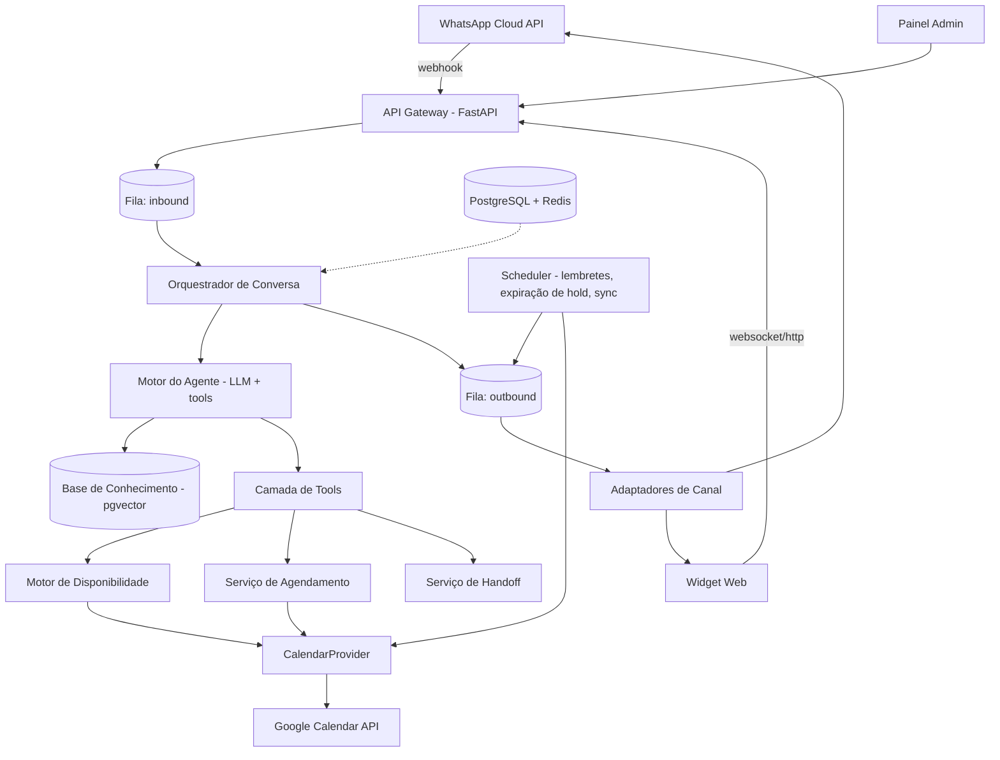

## 7. Arquitetura

### 7.1 Visão de componentes

### 7.2 Princípios de arquitetura

1. **Ingestão desacoplada do processamento.** O webhook só valida, deduplica, persiste e enfileira. Qualquer indisponibilidade do LLM não gera perda de mensagem.
2. **O LLM não é fonte de verdade.** Disponibilidade, preço, política e regras vêm de código e banco. O LLM decide *o que perguntar e quando chamar a tool*, não *qual horário existe*.
3. **Toda capacidade externa é uma tool com contrato explícito.** Nenhuma escrita externa acontece fora de uma tool auditada.
4. **Providers plugáveis.** `ChannelProvider` e `CalendarProvider` são interfaces. Google Calendar é a primeira implementação; agenda própria e softwares verticais entram depois sem tocar no agente.
5. **Configuração declarativa por tenant.** O comportamento específico do cliente vive em YAML versionado + JSONB, não em `if tenant == 'x'`.

### 7.3 Decisões de arquitetura (ADR resumidos)

| # | Decisão | Alternativa descartada | Razão |
|---|---|---|---|
| ADR-1 | Multi-tenant em banco único com `tenant_id` + RLS | Banco por tenant | Custo e operação. RLS dá isolamento suficiente para o porte alvo. Migração para schema-por-tenant continua possível. |
| ADR-2 | Agente com tool calling livre + estágios como *contexto*, não como máquina de estados rígida | Fluxo determinístico por state machine | Conversas reais são não-lineares (pergunta preço no meio do agendamento). A rigidez quebra a experiência. Determinismo fica nas tools. |
| ADR-3 | Google Calendar como fonte de verdade da ocupação; banco como fonte de verdade do agendamento | Só banco, ou só Calendar | O prestador continua usando o Google. Ignorar isso gera overbooking real. |
| ADR-4 | Hold transacional em banco + advisory lock, não confiança no free/busy | Só checar free/busy antes de criar | Free/busy tem latência de propagação e não protege de corrida entre duas conversas. |
| ADR-5 | Fila em Redis (ARQ/Celery) em vez de broker dedicado | Kafka/SQS | Volume de PME não justifica; menos peças para operar. Interface abstraída se o volume mudar. |
| ADR-6 | RAG com pgvector no mesmo Postgres | Vector DB dedicado | Base de conhecimento por tenant é pequena (dezenas de documentos). Menos infraestrutura. |
| ADR-7 | Widget web reutiliza a mesma engine via adaptador de canal | Produto separado | Uma engine, dois transportes. |

---
