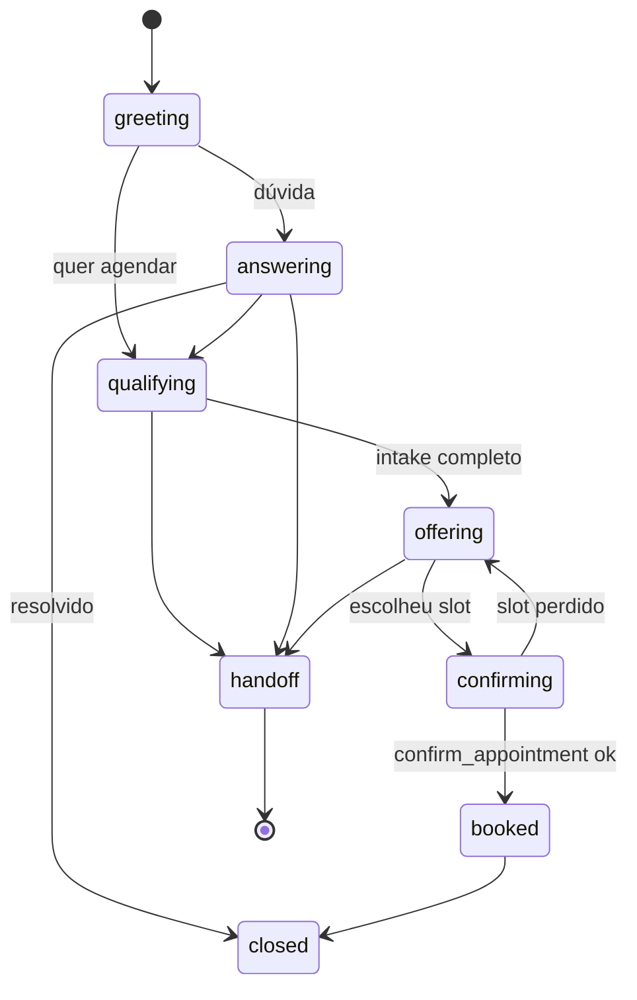

## 11. Motor do agente

### 11.1 Loop de execução

```
1. Worker inbound consome mensagem agregada (debounce)
2. Carrega: tenant config, conversa, últimas N mensagens, resumo, campos coletados
3. Guardrails de entrada: gatilhos de escalonamento por keyword/regex → curto-circuito
4. Recupera contexto da base de conhecimento (RAG) com a mensagem do usuário
5. Monta system prompt (seção 11.2) + histórico + resultado do RAG
6. Chama LLM com o conjunto de tools (seção 11.4)
7. Enquanto houver tool_use:
     - valida args (Pydantic)
     - executa tool com tenant_id do contexto (nunca do argumento)
     - registra em audit_log
     - devolve resultado ao LLM
     - limite: MAX_TOOL_ITERATIONS = 6
8. Guardrails de saída (seção 11.5)
9. Persiste mensagem, campos extraídos, novo stage, custo
10. Enfileira envio no canal
```

**Regra:** o passo 7 nunca chama duas vezes uma tool de escrita com a mesma chave de idempotência. Se o modelo insistir, a tool retorna o resultado anterior.

### 11.2 System prompt (template)

O prompt é montado por composição, não é uma string fixa. Blocos, nesta ordem:

```
[IDENTIDADE]
Você é {persona.agent_name}, assistente virtual de {identity.name}.
{identity.about}
Você conversa por {channel} com clientes e potenciais clientes.

[SEU PAPEL]
Seu trabalho é: (1) responder dúvidas sobre o estabelecimento e os serviços,
(2) entender o que a pessoa precisa, (3) agendar o atendimento.
Você não faz mais nada além disso.

[LIMITES INEGOCIÁVEIS]
- Nunca dê orientação clínica, diagnóstico, indicação de medicamento ou
  conselho de saúde. Isso é papel do profissional na consulta.
- Nunca afirme preço, horário, política ou disponibilidade que não esteja
  na base de conhecimento ou não tenha vindo de uma ferramenta. Se não sabe, diga.
- Nunca prometa horário sem chamar `check_availability`.
- Nunca confirme agendamento sem chamar `confirm_appointment` e receber sucesso.
- Nunca invente dados do cliente. Se falta informação, pergunte.
- Se a pessoa pedir para falar com humano, chame `escalate_to_human` na hora.

[ESTILO]
Tom: {persona.tone}. Tratamento: {persona.address_form}.
Mensagens curtas — no máximo {persona.max_message_chars} caracteres.
Uma pergunta por vez. Nada de listar tudo de uma vez.
Prefira: {persona.vocabulary.prefer}. Evite: {persona.vocabulary.avoid}.
{regra de emoji}

[O QUE VOCÊ PRECISA DESCOBRIR ANTES DE AGENDAR]
{intake.required e conditional renderizados}
Já coletado nesta conversa: {collected}
Ainda falta: {missing}
Extraia o que a pessoa já disser, mesmo fora de ordem. Não repergunte.

[CATÁLOGO DE SERVIÇOS]
{lista compacta: nome, duração, preço/observação, modalidade}

[CONTEXTO DO ESTABELECIMENTO]
{trechos recuperados da base de conhecimento}

[QUEM É A PESSOA]
{contact + subjects + últimos agendamentos, se houver}

[AGORA]
Data e hora: {now na timezone da unidade}
Estágio da conversa: {stage}
```

**Diretriz de manutenção:** blocos são testáveis isoladamente. Mudança em `[LIMITES INEGOCIÁVEIS]` exige rodar a suíte conversacional inteira (seção 19.3).

### 11.3 Estágios da conversa

`stage` é informativo — orienta o modelo e alimenta métricas de funil. Não bloqueia transições.



### 11.4 Tools

Contratos (JSON Schema resumido). `tenant_id` **nunca** é argumento — vem do contexto de execução.

| Tool | Tipo | Descrição |
|---|---|---|
| `search_knowledge` | leitura | Busca na base de conhecimento do tenant. |
| `list_services` | leitura | Catálogo com duração, preço, modalidade. Aceita filtro textual. |
| `check_availability` | leitura | Retorna slots reais. **Única fonte de horário.** |
| `hold_slot` | escrita | Reserva temporária de um slot. |
| `confirm_appointment` | escrita | Efetiva o agendamento e cria o evento no calendário. |
| `find_appointments` | leitura | Agendamentos futuros do contato. |
| `reschedule_appointment` | escrita | Move um agendamento existente. |
| `cancel_appointment` | escrita | Cancela. |
| `save_contact_info` | escrita | Persiste nome, subject (pet/dependente), atributos. |
| `join_waitlist` | escrita | Entra na lista de espera (Fase 3). |
| `escalate_to_human` | escrita | Abre handoff e silencia o agente. |

```jsonc
// check_availability
{
  "name": "check_availability",
  "description": "Retorna horários realmente disponíveis. Use SEMPRE antes de mencionar qualquer horário ao cliente. Não invente horários.",
  "input_schema": {
    "type": "object",
    "properties": {
      "service_id":   { "type": "string", "description": "ID do catálogo (list_services)" },
      "provider_id":  { "type": "string", "description": "Opcional. Omitir = qualquer profissional apto." },
      "date_from":    { "type": "string", "format": "date" },
      "date_to":      { "type": "string", "format": "date" },
      "preferred_weekdays": { "type": "array", "items": { "enum": ["mon","tue","wed","thu","fri","sat","sun"] } },
      "preferred_periods":  { "type": "array", "items": { "enum": ["morning","afternoon","evening"] } },
      "limit": { "type": "integer", "default": 3, "maximum": 10 }
    },
    "required": ["service_id", "date_from", "date_to"]
  }
}

// Retorno
{
  "slots": [
    { "slot_token": "eyJ...", "starts_at": "2026-09-09T14:00:00-03:00",
      "ends_at": "2026-09-09T14:30:00-03:00",
      "provider_id": "…", "provider_name": "Dra. Ana",
      "human": "quarta-feira, 9 de setembro, às 14h" }
  ],
  "has_more": true,
  "next_available_date": "2026-09-09"
}
```

```jsonc
// confirm_appointment
{
  "name": "confirm_appointment",
  "description": "Efetiva o agendamento. Só chame após o cliente escolher explicitamente um horário e todos os campos obrigatórios estarem coletados.",
  "input_schema": {
    "type": "object",
    "properties": {
      "hold_id":    { "type": "string" },
      "subject_name": { "type": "string" },
      "intake":     { "type": "object", "description": "Campos coletados, chave->valor" },
      "notes":      { "type": "string" }
    },
    "required": ["hold_id"]
  }
}

// Retorno de sucesso
{ "status": "confirmed", "appointment_id": "…", "starts_at": "…",
  "provider_name": "…", "address": "…", "price_line": "…", "prep_line": "…" }

// Retorno de falha recuperável
{ "status": "hold_expired", "message": "O horário não está mais reservado.",
  "suggested_action": "call check_availability again" }
```

`slot_token` é assinado (HMAC) e carrega `provider_id`, `resource_id`, `service_id`, `starts_at`. Isso impede que o modelo fabrique um slot.

### 11.5 Guardrails

**Entrada (antes do LLM):**
- Match de `escalation.triggers` por keyword/regex → curto-circuito com resposta configurada + handoff.
- Rate limit por contato (anti-flood).
- Detecção de tentativa de prompt injection em conteúdo recebido (mensagem, nome de arquivo, texto de imagem): conteúdo de usuário nunca é tratado como instrução.

**Saída (depois do LLM, antes de enviar):**
- **Validação de horário:** se a resposta contém padrão de data/hora, precisa existir uma chamada de `check_availability` ou `confirm_appointment` no mesmo turno com aquele horário no resultado. Senão, descarta e regenera; na segunda falha, escala.
- **Validação de preço:** número precedido de "R$" só passa se existir no catálogo ou no resultado do RAG.
- **Escopo:** classificador leve para orientação clínica/jurídica/financeira → substitui pela resposta de recusa configurada.
- **Comprimento:** quebra em múltiplas mensagens respeitando `max_message_chars`.
- **PII:** nunca ecoar documento, cartão ou dado sensível recebido.

**Circuit breaker:** se `messages_count > limits.max_messages_per_conversation` ou `cost > limits.max_llm_cost_usd_per_conversation`, escala automaticamente.

### 11.6 Base de conhecimento (RAG)

- Fontes por tenant: FAQ escrita no onboarding, página "sobre"/"serviços" do site, políticas (cancelamento, convênios, formas de pagamento), instruções de preparo, informações práticas (estacionamento, acessibilidade, o que levar).
- Ingestão: chunk de ~500 tokens com overlap de 80, embedding, `knowledge_chunks`.
- Recuperação: top-k=5 por similaridade de cosseno, filtrado por `tenant_id`, com corte de score mínimo.
- Se nada passar do corte, o bloco de contexto vem vazio e o prompt orienta a declarar desconhecimento.
- Edição pelo painel; reingestão automática ao salvar.

### 11.7 Memória e extração

- Histórico completo em banco; janela enviada ao LLM = últimas 20 mensagens + `summary`.
- `summary` regenerado a cada 15 mensagens.
- `collected` atualizado a cada turno por extração estruturada (chamada barata e separada, ou pela própria tool `save_contact_info`). O prompt sempre recebe `collected` e `missing` calculados em código — não é o modelo que decide se o intake terminou.

---
